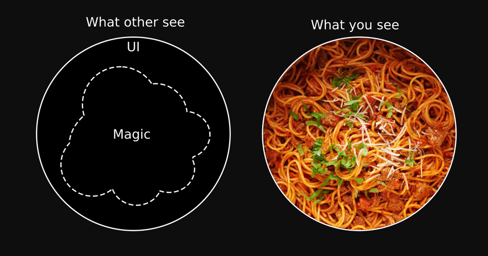
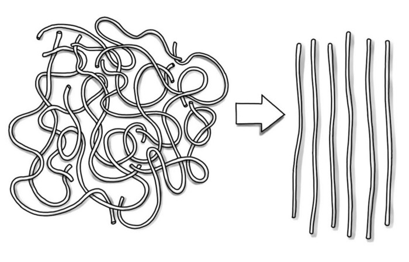
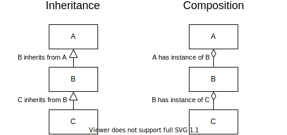
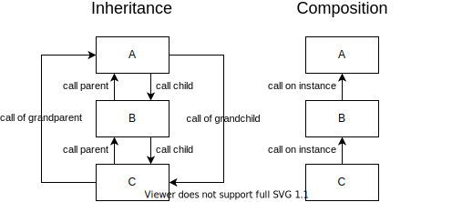

<style>
footer, .footer {
  font-size: 50%;
  color: gray;
}
strong {
  color: #d67500;
}
.reveal pre code {
  max-height: 80%;
}
.reveal h1, .reveal h2, .reveal h3, .reveal h4, .reveal h5, .reveal h6 {
  text-transform: none;
}
.emoji {
    font-family: apple color emoji,segoe ui emoji,noto color emoji,android emoji,emojisymbols,emojione mozilla,twemoji mozilla,segoe ui symbol;
}
.lego-cropped {
  width: 619px;
  height: 284px;
  object-fit: cover;
  object-position: 0 -1px;
}
</style>

# Composition

<!--  -->

 <!-- .element: class="lego-cropped" -->

<!-- How to combine functionality in a flexible and understandable way? -->
&shy;<!-- .element: class="fragment" -->
Part I: Building blocks in software development

Note:

- lateinisch *compositio* "Zusammenstellung, Zusammensetzung"
- Reise zur Wurzel
- Vererbung kann auch als eine Form von Komposition gesehen werden
- Beziehungen zwischen Bausteinen
    - viele wiederverwendbare/kombinierbare kleine Teile
    - statt lauter Spezialteile

---

## Question

&shy;<!-- .element: class="fragment" -->
How does a computer work?

Note:

- Stichwort CPU
- Register/Memory
- Operationen/instructions

---

## Kinds of building blocks

---

### Instructions

> CPU \[...\] executes instructions that make up a computer program.
> The CPU performs basic arithmetic, logic, controlling, and input/output (I/O)
> operations specified by the instructions in the program.

----

### Memory

----

#### Questions

----

#### What is a **Bit**?

> Kleinste **unterscheidbare** Informationseinheit
<!-- .element: class="fragment" -->

#### What is a **Byte**?

> Kleinste **adressierbare** Informationseinheit
<!-- .element: class="fragment" -->

----

#### What is a **Word**?

> **Operand:** Smallest information unit used in operations
<!-- .element: class="fragment" data-fragment-index="1" -->

#### What is a **Register**?

> High speed storage area in the CPU (usually word sized).
> All data must be stored in a register before it can be processed.
<!-- .element: class="fragment" data-fragment-index="2" -->

Note:

- [Word (computer architecture)](https://en.wikipedia.org/wiki/Word_(computer_architecture))
- [Register](https://www.computerscience.gcse.guru/glossary/register)

---

## Assembly

----

[ASM vs. C](https://www.quora.com/What-is-the-difference-between-assembly-language-and-C-language#:~:text=In%20assembly%20language%20you%20write,is%20a%20high%20level%20language.)

---

## Terms

----

### State

#### Object vs. Parameter

<!-- TODO how to show code blocks side by side -->

```js
object = new Object(state)
renderer.drawRect(x, y, w, h)
```

```js
drawRect(renderer, x, y, w, h)
```

```ts
let globalState = ...

function f(stateRequiredByFunction) { ... }

class MyObject {
  constructor(private stateSharedByMethods) { ... }

  a(stateRequiredByMethodA) { ... }
  b(stateRequiredByMethodB) { ... }
}  
```

----

### Polymorphism

----

### Static vs. Dynamic Dispatching

Note:
- Static Dispatching is possible when your IDE jumps to the definition of a
  method and not only the declaration ;-)

---

### Complexity

&shy;<!-- .element: class="fragment"  data-fragment-index="1" -->
Word of Latin origin: *cum plectere*

&shy;<!-- .element: class="fragment"  data-fragment-index="2" -->
Translatable as *entangled* or *interlinked*

&shy;<!-- .element: class="fragment"  data-fragment-index="3" -->
[](https://66.media.tumblr.com/a608e05057248b57ffa1be1f95c2c335/tumblr_ofgmk70nUh1r9zeo4o1_500.gif)

<footer class="fragment" data-fragment-index="3">
    From the TV series <em>Dirk Gently's Holistic Detective Agency</em>
</footer>

Note:
- hard to understand
- many connections
- many potentially possible execution path

Zum Zitat:
- "Alles ist miteinander verflochten"
- In der TV-Serie die Ereignisse und Handlungsstränge der Protagonisten
- Im Code können viele Abhängigkeiten bzw. Verbindungen von Komponenten zu
  vielen möglichen Ausführungspfaden führen, die schwer zu überblicken sein
  können
- Ich beziehe mich mit dem Begriff Komplexität in diesem Vortrag also nicht auf
  Aufwand oder Kosten eines Algorithmus

----

#### Entangled Code

[](https://www.reddit.com/r/ProgrammerHumor/comments/82gvzc/another/)

----

#### Disentangle
[](https://medium.com/@AhoiNadjeschda/sorting-the-spaghetti-or-the-aware-ego-process-book-snippet-29-971dcd6c0c2b)

---

[](http://www.quickmeme.com/p/3w53xj)

----

  <!-- .element: style="filter: invert(90%);" -->

----

  <!-- .element: style="filter: invert(90%);" -->

----


----

[](https://medium.com/@AhoiNadjeschda/sorting-the-spaghetti-or-the-aware-ego-process-book-snippet-29-971dcd6c0c2b)

---

## Inheritance

Note:
- Java/PHP: final class and method

---

### Class Based Inheritance

---

### Diamond Problem

---

### Mixin Based Inheritance

> Und wegen des Fehlens geeigneter Kompositionsoperatoren, welche dabei helfen, Namenskonflikte zwischen miteinander konkurrierenden Methoden zu lösen, erfolgt Mixin-Komposition immer geradlinig in geordeter Reihenfolge.

http://peterseliger.blogspot.com/2014/06/die-vielen-talente-von-javascript.html#mixins

----

#### Sass Mixins

https://sass-lang.com/documentation/at-rules/mixin

----

#### Dart Mixins

https://dart.dev/guides/language/language-tour#adding-features-to-a-class-mixins

----

#### TypeScript Mixin Pattern

https://www.typescriptlang.org/docs/handbook/mixins.html

----

#### PHP Traits (actually Mixins 😉)

https://www.typescriptlang.org/docs/handbook/mixins.html

---

### Trait Based Inheritance

http://peterseliger.blogspot.com/2014/06/die-vielen-talente-von-javascript.html#traits

Java Interface Default Implementation

---

## Composition

> Composition over inheritance

[Mixins Considered Harmful](https://reactjs.org/blog/2016/07/13/mixins-considered-harmful.html)
[From Mixins to Object Composition](https://raganwald.com/2016/07/20/prefer-composition-to-inheritance.html)
[Re-use in OO: Inheritance, Composition and Mixins](https://naildrivin5.com/blog/2012/12/19/re-use-in-oo-inheritance.html)

---

### [Object Composition](https://en.wikipedia.org/wiki/Object_composition)

#### Combine & Delegate

#### Association vs. Aggregation

----

#### Delegation

Built-in syntax in Kotlin

----

https://dev.to/riccardo_cardin/template-method-pattern-revised-3od3

---

### [Functional Composition](https://en.wikipedia.org/wiki/Function_composition_(computer_science))

----

### Notations

### Method
```js
values.map(fn)
```

### Function
```js
map(fn, values)
```

### Curried Function
```js
map(fn)(values)
```

----

```js
map(x => x + 1, [1, 2, 3]) // [2, 3, 4]
```

---

### RxJS Example

```js
import { range } from 'rxjs'
import { map, filter, take, toArray } from 'rxjs/operators'

const source$ = range(0, 10)

source$
  .pipe(
    filter(x => x % 2 === 0),
    map(x => x + x),
    take(3),
    toArray()
  )
  .subscribe(x => console.log(x))

// Logs:
// [0, 4, 8]
```

---

The End.


---

Your code is inspiring

&shy;<!-- .element: class="fragment" -->


<footer class="fragment">
 If you write spaghetti code, your colleagues will likely, too
 <span class="emoji">😉</span>
</footer>

---

## [Talents](http://scg.unibe.ch/archive/papers/Ress11a-Talents.pdf)

### Dynamically Composable Units of Reuse

> … object-specific units of reuse which model features that an object
> can acquire **at run-time**.

----

### Talents vs. Traits

> **Like a trait**, a talent represents a set of methods that constitute part of
> the behavior of an object.

> **Unlike traits**, talents can be acquired (or lost) dynamically.
> When a talent is applied to an object, no other instance of the object’s
> class are affected.

----

### Composition of Talents

> Talents may be composed of other talents, however, as with traits,
> the composition **order** is irrelevant.
> **Conflicts** must be explicitly resolved.

----

### Composition: Talents vs. Traits

> Like traits, **talents can be flattened**, either by incorporating the talent
> into an existing class, or by introducing a new class with the new methods.
> However, flattening is purely static and results in the **loss of the dynamic**
> description of the talent on the object. Flattening is not mandatory, on the
> contrary, it is just a convenience feature which shows how **traits are a
> subset of talents**.

---

## Composition in Angular

### Directive

### Pipe

### Decorator? Eigentlich TypeScript bzw. JavaScript

[Use decorator to beat ngOnChanges – Decoupling ngOnChanges | Kern Zhao](https://www.youtube.com/watch?v=rVDMmlCRvkg&ab_channel=ng-conf)
[Example](https://stackblitz.com/github/zhaosiyang/property-watch-decorator-example?file=src%2Fapp%2Fchild%2Fchild.component.ts)
Decorators may not change the type of the

### Composable Components (smart vs. dumb)

[Article](https://medium.com/@jtomaszewski/how-to-write-good-composable-and-pure-components-in-angular-2-1756945c0f5b)

Bei DSA sollte man Dialog und Komponente in 2 Komponenten teilen (siehe
z.B. `ResolveAbsenceCardComponent`)

Bausteine Aus einem Guss (z.B. Stuhl) vs. Zusammengebaut aus mehreren
Teilen/Komponenten Lego vs. Playmobil Anleitung: DINA3 vs Buch - DINA3 - eine
Seite - ein Stück/Teil - Sprache: Jedes Wort/Satz nebeneinander in
unterschiedlichen Sprachen - schlechter zu lesen (eigene Sprache muss bei jedem
Wort/Satz gesucht werden)
- schlechter zu erweitern - Sprache hinzufügen => komplettes Layout überarbeiten
- Satz ergänzen => komplettes Layout überarbeiten - leichter in der Herstellung
- Buch - mehrere Seiten - Buchdeckel - für jede Sprache ein Abschnitt (jeder
gleich aufgebaut)
- besser zu lesen - Abschnitte nach Sprache getrennt (einmalige Suche nach
eigener Sprache)
- Inhaltsverzeichnis (auf welcher Seite ist was zu finden)
- besser zu erweitern - Sprache hinzufügen - neuen Abschnitt (gleich aufgebaut
wie bisherige) hinzufügen - bestehende Abschnitte bleiben unverändert -
Inhaltsverzeichnis ergänzen - Satz ergänzen - Layout für Abschnitt überarbeiten
- komplettes Layout muss **nicht** überarbeitet werden - komplexer in der
Herstellung - Teile müssen zusammengebaut werden - Seiten müssen z.B. mit
Buchdeckel gebunden werden

Alle Komponenten fest verbaut vs Anschlussmöglichkeiten (Dockingstation)
- Ghettoblaster vs. Stereoanlage

[The Power Of Composition - Folien](https://www.slideshare.net/ScottWlaschin/the-power-of-composition)

The philosophy of composition:

- connectable
- no adapters
- reusable parts

- immutable data
- self contained
    - no side-effects, no I/O, no globals, etc

# [The Power of Composition - Scott Wlaschin](https://youtu.be/vDe-4o8Uwl8)

- gute Motivation
- passende Bilder zur Veranschaulichung (Lego, Modell-Eisenbahn)
- only functional- and type-composition (mainly functional)

[Lego Philosophy](https://youtu.be/vDe-4o8Uwl8?t=321)

1. All pieces are designed to be connected
2. Connect two pieces together and get another "piece"
   that can still be connected
3. The pieces are reusable in many contexts

> Bloch talks about some of the "mistakes" that were made in the initial
> implementation and how they have worked at trying to fix them.

Zitat von https://stackoverflow.com/a/568041/1065654
See book Effective Java

Entwicklung von Bibliotheken:

- Java Stream API
- C++ Ranges
- RxJS pipe

docker-compose: compose services (i.e. Docker container)

Functional Programming/Composition ist nicht der heilige Graal

- memory management
- performance (immutable data, call stacks, etc.)
  aber OOP erfordert mehr Disziplin und Vorausdenken

> [...] avoid code reuse in favor of behaviour reuse
> Code reuse leads to an increase of dependency between classes,
> resulting in architectures, which components are tightly coupled.

https://dev.to/riccardo_cardin/template-method-pattern-revised-3od3
http://blog.rcard.in/programming/oop/software-engineering/2017/04/10/dependency-dot.html


"The fact that 'goto' can do anything is exactly why we don't use it"
Bjarne Stroustrup
