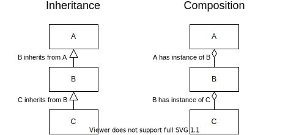

<svg xmlns="http://www.w3.org/2000/svg"
     xmlns:xlink="http://www.w3.org/1999/xlink" version="1.1" width="81px"
     height="481px" viewBox="-0.5 -0.5 81 481">
  <defs></defs>
  <g>
    <rect x="0" y="0" width="80" height="160" fill="#e6e6e6" stroke="#666666"
          pointer-events="all"></rect>
    <g transform="translate(-0.5 -0.5)">
      <switch>
        <foreignObject style="overflow: visible; text-align: left;"
                       pointer-events="none" width="100%" height="100%"
                       requiredFeatures="http://www.w3.org/TR/SVG11/feature#Extensibility">
          <div xmlns="http://www.w3.org/1999/xhtml"
               style="display: flex; align-items: unsafe center; justify-content: unsafe center; width: 78px; height: 1px; padding-top: 80px; margin-left: 1px;">
            <div
              style="box-sizing: border-box; font-size: 0; text-align: center; ">
              <div
                style="display: inline-block; font-size: 12px; font-family: Helvetica; color: #000000; line-height: 1.2; pointer-events: all; white-space: normal; word-wrap: normal; ">
                Dark Age
              </div>
            </div>
          </div>
        </foreignObject>
        <text x="40" y="84" fill="#000000" font-family="Helvetica"
              font-size="12px" text-anchor="middle">Dark Age
        </text>
      </switch>
    </g>
    <rect x="0" y="160" width="80" height="160" fill="#e6e6e6" stroke="#666666"
          pointer-events="all"></rect>
    <g transform="translate(-0.5 -0.5)">
      <switch>
        <foreignObject style="overflow: visible; text-align: left;"
                       pointer-events="none" width="100%" height="100%"
                       requiredFeatures="http://www.w3.org/TR/SVG11/feature#Extensibility">
          <div xmlns="http://www.w3.org/1999/xhtml"
               style="display: flex; align-items: unsafe center; justify-content: unsafe center; width: 78px; height: 1px; padding-top: 240px; margin-left: 1px;">
            <div
              style="box-sizing: border-box; font-size: 0; text-align: center; ">
              <div
                style="display: inline-block; font-size: 12px; font-family: Helvetica; color: #000000; line-height: 1.2; pointer-events: all; white-space: normal; word-wrap: normal; ">
                Imperative Age
              </div>
            </div>
          </div>
        </foreignObject>
        <text x="40" y="244" fill="#000000" font-family="Helvetica"
              font-size="12px" text-anchor="middle">Imperative Age
        </text>
      </switch>
    </g>
    <rect x="0" y="320" width="80" height="160" fill="#e6e6e6" stroke="#666666"
          pointer-events="all" class="fragment"></rect>
    <g transform="translate(-0.5 -0.5)">
      <switch>
        <foreignObject style="overflow: visible; text-align: left;"
                       pointer-events="none" width="100%" height="100%"
                       requiredFeatures="http://www.w3.org/TR/SVG11/feature#Extensibility">
          <div xmlns="http://www.w3.org/1999/xhtml"
               style="display: flex; align-items: unsafe center; justify-content: unsafe center; width: 70px; height: 1px; padding-top: 400px; margin-left: 5px;">
            <div
              style="box-sizing: border-box; font-size: 0; text-align: center; ">
              <div
                style="display: inline-block; font-size: 12px; font-family: Helvetica; color: #000000; line-height: 1.2; pointer-events: all; white-space: normal; word-wrap: normal; ">
                Object Oriented Age
              </div>
            </div>
          </div>
        </foreignObject>
        <text x="40" y="404" fill="#000000" font-family="Helvetica"
              font-size="12px" text-anchor="middle">Object Orien...
        </text>
      </switch>
    </g>
  </g>
  <switch>
    <g requiredFeatures="http://www.w3.org/TR/SVG11/feature#Extensibility"></g>
    <a transform="translate(0,-5)"
       xlink:href="https://www.diagrams.net/doc/faq/svg-export-text-problems"
       target="_blank">
      <text text-anchor="middle" font-size="10px" x="50%" y="100%">Viewer does
        not support full SVG 1.1
      </text>
    </a></switch>
</svg>


---

[//]: # (TODO Anspielung an "From Zero To Hero", Sarah Connor, Robots)
<!-- Decrease font-size to fit heading in one line -->
<h1 class="r-fit-text">
  From
  <span class="data-dark-color">Bits</span>
  To Big
  <span class="logic-and-data-dark-color">Apps</span>
</h1>
<hr>
<h2>
  How
  <span class="rainbow-text">Composition</span>
  works from the ground up
</h2>

Note:
- show first slide (H2 headings) of each section to give an overview
- Motivation:
  - Ich möchte euch nicht nur Wissen vermitteln,
    sondern eure Art zu denken ändern
  - Als Anfänger schreibt man oftmals alles nur in einer einzelnen Funktion
    (meist imperativ)
  - Später lernt man seinen Code in Funktionen, Objekte, etc. zu teilen (Übersichtlichkeit, Wiederverwendbarkeit, etc.)
  - Als erfahrene Programmierer zerlegen wir unseren Code oft automatisch (Automatismus)
  - Uns hat unter anderem unsere eigene Erfahrung, sowie die von anderen geprägt:
    - best practices
    - Leitsätze
    - Richtlinien
    - Design Patterns (Gang of Four)
    - Design Prinzipien (SOLID)
    - TODO einordnen: Clean Architecture
    - etc.
  - Wir gehen den zu Grunde liegenden ... auf den Grund
- Vorgehensweise:
  - Bausteine werden bottom-up erarbeitet
    - neue Bausteine müssen aus bekannten aufgebaut sein
  - Aufgabem sind top-down
    - Problem muss in (immer) kleinere Probleme/Bausteine zerlegt werden
  - Wir nähern uns dem Thema immer wieder von beiden Seiten


[//]: # (TODO show AOE tech-tree, 1 age pro presentation day)
- https://aoe2techtree.net
- Wenn wir genügend Resourcen gesammelt haben,
  können wir ins nächste Zeitalter <span class="emoji">😉</span>

---

<h2>
  <span class="rainbow-text">
    Composition
  </span>
</h2>

> Compose **smaller** things
> <sup class="fragment no-space-hidden" data-fragment-index="3">1</sup>
> <br>
> to build **bigger** things
> <sup class="fragment no-space-hidden" data-fragment-index="4">2</sup>
<!-- .element: class="fragment" data-fragment-index="1" -->

<footer class="fragment" data-fragment-index="2">
    Michael Maier
</footer>

&shy;<!-- .element: class="footer fragment" data-fragment-index="3" -->
<sup>1</sup> We call those "smaller things" _building blocks_

&shy;<!-- .element: class="footer fragment" data-fragment-index="4" -->
<sup>2</sup> We call those "bigger things" also _building blocks_ if they are used to
build even bigger things

----

<h2>
  <span class="rainbow-text">
    Composability
  </span>
</h2>

### exchangability and connectability of building blocks
- Bausteine der gleichen Form sind
  - austauschbar
  - leicht (ohne Adapter) kombinierbar (nur Operator notwendig)
- Bausteine unterschiedlicher Form benötigen ein Verbindungsstück
  oder einen passenden Adapter

Note:
- Bezug auf Gleise und Weichen aus Functional Composition

----

<h3>
  <span class="emoji">✂️</span>
  Teilen und Herrschen
  <span class="icon icon-right laurel-wreath"></span>
</h3>


> Wie löst man große Probleme?<br>
> <span class="fragment" data-fragment-index="2">
> Indem man sie in kleinere zerlegt.
> </span>
<!-- .element: class="fragment" data-fragment-index="1" -->

<footer class="fragment" data-fragment-index="3">
    Michael Maier
</footer>

> Wenn man kein passendes Zitat findet,
> kann man sich immer noch selbst zitieren.
> <span class="emoji fragment" data-fragment-index="5">😉</span>
<!-- .element: class="fragment" data-fragment-index="4" -->

<footer class="fragment" data-fragment-index="5">
    Michael Maier
</footer>

---

## Encoding Information <!-- .element: class="data-dark-color" -->

<!-- Bit(s) -> Bytes (new building block built of bits) -> Data -> Logic -->

----

<div style="display: flex; padding: 0 0.5em;">
  <h3 class="icon-heading-inline">
    <span class="icon data-achievement-badge data-dark-color">
      Bit
    </span>
  </h3>
  <blockquote style="padding: 5px 16px;">
    <p class="r-fit-text">
      Kleinste
      <strong>unterscheidbare</strong>
      Informationseinheit
    </p>
  </blockquote>
</div>
<div style="display: flex; padding: 0 0.5em;">
  <h3 class="icon-heading-inline">
    <span class="icon data-achievement-badge data-dark-color">
      Byte
    </span>
  </h3>
  <blockquote style="padding: 5px 16px;">
    <p class="r-fit-text">
      Kleinste
      <strong>adressierbare</strong>
      Informationseinheit
    </p>
  </blockquote>
</div>
<div style="display: flex; padding: 0 0.5em;">
  <h3 class="icon-heading-inline">
    <span class="icon data-achievement-badge data-dark-color">
      Word
    </span>
  </h3>
  <blockquote style="padding: 5px 16px;">
    <p>
      <span class="data-dark-color">Operand:</span>
      Smallest information unit used in
      <span class="logic-dark-color">
        operations
      </span>
    </p>
  </blockquote>
</div>

Note:
- https://de.wikipedia.org/wiki/Datenwort

----

Gruppierung von Informationseinheiten kann man beliebig weiter treiben

> Ein Bit, ein Byte, ich weiß Bescheid
<!-- .element: class="fragment" data-fragment-index="1" -->

<footer class="fragment" data-fragment-index="2">
    Michael Maier
</footer>

> Nur ein Narzisst zitiert sich selbst <span class="emoji fragment" data-fragment-index="4">😜</span>
<!-- .element: class="fragment" data-fragment-index="3" -->

<footer class="fragment" data-fragment-index="4">
    Michael Maier
</footer>

----

### Interpretation von Informationseinheiten

Was können diese 4 Bytes je 8 Bits darstellen?

```text
01000001 01010011 01000011 00000000
```

```c
float: 3.5789127255e-19
int32: 550716160
2x int16: 8403 17152
ASCII string: "ASC"
```
<!-- .element: class="fragment" -->

<!-- .slide: class="fragmented-lists strong--type-dark-color" -->

- **float** vs. **int** vs. **char**
- **int16** vs. **int32**
- **signed** vs. **unsigned**
- ...

Note:
- https://www.h-schmidt.net/FloatConverter/IEEE754.html
- https://www.rapidtables.com/convert/number/binary-to-decimal.html
- [ASCII](https://de.wikipedia.org/wiki/American_Standard_Code_for_Information_Interchange)
- Woher weiß man, wie lang der String ist?
- Jedem ASCII Zeichen wird ein Bitmuster aus 7 Bit zugeordnet.
  - Warum verwenden wir 8 Bit?
    - same shape
  - Gleiches gilt fürs NUL Byte
- [Reverse Engineering of unknown binaries by looking for Byte patterns](https://github.com/maiermic/soloshot-session-to-gpx-converter)

----

#### [Endianness](https://en.wikipedia.org/wiki/Endianness)
##### big-endian vs. little-endian

&shy;<!-- .element: style="background-color: white;" -->


<footer>
  See  
  <a href="https://uynguyen.github.io/2018/04/30/Big-Endian-vs-Little-Endian/">
    Big Endian vs Little Endian
  </a>
</footer>

Note:
- Farben in Grafik haben nicht die Bedeutung wie sonst in der Präsentation

---

<h2>
  <span class="icon logic-achievement-badge logic-dark-color">
    Operations
  </span>
</h2>
<h2>
  &
</h2>
<h2>
  <span class="icon data-achievement-badge data-dark-color">
    Registers
  </span>
</h2>

Note:
- hardware is composed too

----

<h3>
  <span class="icon data-achievement-badge data-dark-color">
    Register
  </span>
</h3>
<blockquote style="padding: 5px 16px;">
  <p>
    High speed storage area in the CPU (usually <strong>word</strong> sized).
    All data must be stored in a register before it can be processed.
  </p>
</blockquote>

----

<h3>
  <span class="icon logic-achievement-badge logic-dark-color">
    Operations
  </span>
</h3>

<iframe width="800px" height="400px" src="https://gcc.godbolt.org/e#g:!((g:!((g:!((h:codeEditor,i:(fontScale:14,fontUsePx:'0',j:1,lang:c%2B%2B,selection:(endColumn:1,endLineNumber:9,positionColumn:1,positionLineNumber:9,selectionStartColumn:1,selectionStartLineNumber:9,startColumn:1,startLineNumber:9),source:'//+Type+your+code+here,+or+load+an+example.%0Aint+square(int+num)+%7B%0A++++return+num+*+num%3B%0A%7D%0A%0Aint+twice(int+num)+%7B%0A++++return+num+%2B+num%3B%0A%7D%0A'),l:'5',n:'0',o:'C%2B%2B+source+%231',t:'0')),k:50,l:'4',n:'0',o:'',s:0,t:'0'),(g:!((h:compiler,i:(compiler:g111,filters:(b:'0',binary:'1',commentOnly:'0',demangle:'0',directives:'0',execute:'1',intel:'0',libraryCode:'0',trim:'1'),fontScale:14,fontUsePx:'0',j:1,lang:c%2B%2B,libs:!(),options:'',selection:(endColumn:12,endLineNumber:16,positionColumn:12,positionLineNumber:16,selectionStartColumn:12,selectionStartLineNumber:16,startColumn:12,startLineNumber:16),source:1),l:'5',n:'0',o:'x86-64+gcc+11.1+(Editor+%231,+Compiler+%231)+C%2B%2B',t:'0')),k:50,l:'4',n:'0',o:'',s:0,t:'0')),l:'2',n:'0',o:'',t:'0')),version:4"></iframe>

----

<h3>
  <span class="red-to-blue-text">
    Source To Executable
  </span>
</h3>

<div class="fragment" data-fragment-index="1">

<h4 style="margin-bottom: 0;">
  <span class="logic-dark-color">
    compile-and-show-bits.sh
  </span>
  <span class="data-dark-color">
    file
  </span>
</h4>

```bash
#!/bin/bash
compile() {
  gcc -Wl,--build-id=const \
      -Os -fdata-sections -ffunction-sections -fipa-pta \
      -Wl,--gc-sections -Wl,--as-needed -Wl,--strip-all \
      -xc -o "$1" "$1.c"
}
compile $1
xxd -bits "$1"     # show binary as bits
```

</div>

----

<h3>
  <span class="red-to-blue-text">
    Source To Executable
  </span>
</h3>

<h4 class="data-dark-color">
  return127.c
</h4>

```c
int main() {
    return 127; // equivalent to binary number 01111111
}
```

<div class="fragment" data-fragment-index="1">

<h4 style="margin-bottom: 0;">
  <span class="logic-dark-color">
    compile-and-show-bits.sh
  </span>
  <span class="data-dark-color">
    return127
  </span>
</h4>

<pre class="code">
00000000: 01111111 01000101 01001100 01000110 00000010 00000001  .ELF..
00000006: 00000001 00000000 00000000 00000000 00000000 00000000  ......
...
000004ce: 00000000 00000000 10111000 <span style="color: #8cd0d3">01111111</span> 00000000 00000000  ......
...
000016f2: 00000000 00000000 00000000 00000000 00000000 00000000  ......
000016f8: 00000000 00000000 00000000 00000000 00000000 00000000  ......
000016fe: 00000000 00000000                                      ..
</pre>

</div>

----

### Comparing Binaries <span class="emoji">🤔</span>

<div style="display: flex;justify-content: space-between;width: calc(90% + 10px);margin: auto;">
    <div style="display: flex; flex-direction: column; width: 48%;">


##### return127.c <!-- .element: style="margin-bottom: 0px;" class="data-dark-color" -->

```c
int main() {
    return 127;
}
```
<!-- .element: style="width: 100%; margin-top: 4px" -->


  </div>
  <div style="display: flex; flex-direction: column; width: 48%;">


##### return128.c <!-- .element: style="margin-bottom: 0px;" class="data-dark-color" -->
```c
int main() {
    return 128;
}
```
<!-- .element: style="width: 100%; margin-top: 4px" -->


</div>
</div>

<div class="fragment" data-fragment-index="1">
<h4>
  <span class="logic-dark-color">
    compile-and-show-diff.sh
  </span>
  <span class="data-dark-color">
    file1 file2
  </span>
</h4>

```bash
#!/bin/bash
compile() {
  gcc -Wl,--build-id=const \
      -Os -fdata-sections -ffunction-sections -fipa-pta \
      -Wl,--gc-sections -Wl,--as-needed -Wl,--strip-all \
      -xc -o "$1" "$1.c"
  xxd -b "$1" > "$1.xxd-bits"
}
compile $1
compile $2
diff $1.xxd-bits $2.xxd-bits    # show diff of binary as bits
diffoscope "$1" "$2"  # show diff of binary as hex & assembly
```

</div>

----

### Binary Diff

<div style="display: flex;justify-content: space-between;width: calc(90% + 10px);margin: auto;">
    <div style="display: flex; flex-direction: column; width: 48%;">


##### return127.c <!-- .element: style="margin-bottom: 0px;" class="data-dark-color" -->

```c
int main() {
    return 127;
}
```
<!-- .element: style="width: 100%; margin-top: 4px" -->


  </div>
  <div style="display: flex; flex-direction: column; width: 48%;">


##### return128.c <!-- .element: style="margin-bottom: 0px;" class="data-dark-color" -->
```c
int main() {
    return 128;
}
```
<!-- .element: style="width: 100%; margin-top: 4px" -->


</div>
</div>
<div class="fragment" data-fragment-index="1">

<h4 style="margin-bottom: 0;">
  Diff Bits
  <span class="emoji">🤓</span>
</h4>

<pre class="code">
206c206
<span class="diff-removed-color">&lt; 000004ce: 00000000 00000000 10111000 <span class="diff-removed-highlight-color">01111111</span> 00000000 00000000  ......</span>
&zwnj;---
<span class="diff-added-color">&gt; 000004ce: 00000000 00000000 10111000 <span class="diff-added-highlight-color">10000000</span> 00000000 00000000  ......</span>
</pre>
</div>
<div class="fragment" data-fragment-index="2">


<h4 style="margin-bottom: 0;">
  Diff Hex & Assembly
  <span class="emoji">😎</span>
</h4>

<pre class="code">
<span class="diff-removed-color">- 4d0:	b8 <span class="diff-removed-highlight-color">7f</span> 00 00 00       	mov    $0x<span class="diff-added-highlight-color">7f</span>,%eax</span>
<span class="diff-added-color">+ 4d0:	b8 <span class="diff-added-highlight-color">80</span> 00 00 00       	mov    $0x<span class="diff-added-highlight-color">80</span>,%eax</span>
</pre>

</div>
<footer class="fragment" data-fragment-index="3">
  See  
  <a href="https://stackoverflow.com/questions/67948502/how-to-compile-c-programs-such-that-binaries-differ-only-in-different-return-val">
    How to compile C programs such that binaries differ only in different return value?
  </a>
</footer>

----

### Binary Diff

<div style="display: flex;justify-content: space-between;width: calc(90% + 10px);margin: auto;">
    <div style="display: flex; flex-direction: column; width: 48%;">


##### add1.c <!-- .element: style="margin-bottom: 0px;" class="data-dark-color" -->

```c
int main(int argc, char *argv[]) {
    return argc + 1;
}
```
<!-- .element: style="width: 100%; margin-top: 4px" -->


  </div>
  <div style="display: flex; flex-direction: column; width: 48%;">


##### sub1.c <!-- .element: style="margin-bottom: 0px;" class="data-dark-color" -->
```c
int main(int argc, char *argv[]) {
    return argc - 1;
}
```
<!-- .element: style="width: 100%; margin-top: 4px" -->


</div>
</div>
<div class="fragment" data-fragment-index="1">

<h4 style="margin-bottom: 0;">
  Diff Bits
  <span class="emoji">🤓</span>
</h4>

<pre class="code">
253c253
<span class="diff-removed-color">&lt; 000005e8: 10000011 <span class="diff-removed-highlight-color">11000000</span> 00000001 01011101 11000011 00001111  ...]..</span>
&zwnj;---
<span class="diff-added-color">&gt; 000005e8: 10000011 <span class="diff-added-highlight-color">11101000</span> 00000001 01011101 11000011 00001111  ...]..</span>
</pre>
</div>
<div class="fragment" data-fragment-index="2">

<h4 style="margin-bottom: 0;">
  Diff Hex & Assembly
  <span class="emoji">😎</span>
</h4>

<pre class="code">
<span class="diff-removed-color">- 5e8:	83 <span class="diff-removed-highlight-color">c0</span> 01       	<span class="diff-added-highlight-color">add</span>    $0x1,%eax</span>
<span class="diff-added-color">+ 5e8:	83 <span class="diff-added-highlight-color">e8</span> 01       	<span class="diff-added-highlight-color">sub</span>    $0x1,%eax</span>
</pre>

</div>
<!--
<footer class="fragment" data-fragment-index="3">
  See  
  <a href="https://stackoverflow.com/questions/67948502/how-to-compile-c-programs-such-that-binaries-differ-only-in-different-return-val">
    How to compile C programs such that binaries differ only in different return value?
  </a>
</footer>
-->

---

[//]: # (TODO Module gehören nicht zur Wiederholung)
<h2>
  <span class="data-dark-color">Data</span>
  &
  <span class="logic-dark-color">Logic</span>
</h2>

Note:
- explain colors used in the following slides

----

<h2>
  <span class="icon data-achievement-badge data-dark-color">
    Program
  </span>
  is
  <span class="data-dark-color">Data</span>
  <span class="emoji fragment" data-fragment-index="1">🤔</span>
</h2>

- source and binary are <span class="data-dark-color">files</span><span class="icon icon-right data-achievement-badge"></span>
- binary may contain <span class="data-dark-color">constant values</span><span class="icon icon-right data-achievement-badge"></span>

<div class="fragment" data-fragment-index="2">

<hr>

<h2>
  <span class="icon logic-achievement-badge logic-dark-color">
    Program
  </span>
  is
  <span class="logic-dark-color">Logic</span>
  <span class="emoji">🤔</span>
</h2>

- sequence of <span class="logic-dark-color">operations</span>
  (can be executed)

</div>

----

<!-- .slide: data-auto-animate -->

<h2 class="r-fit-text">
  <span class="icon logic-and-data-achievement-badge logic-and-data-dark-color">
    Program
  </span>
  is
  <span class="data-dark-color">Data</span>
  &
  <span class="logic-dark-color">Logic</span>
  <span class="emoji">🤓💡</span>
</h2>

----

### TODO Überleitung zu Compiler
- meme "wait a minute ... what was gcc"


---

<h2>
  <span class="icon logic-achievement-badge logic-dark-color">
    Compiler
  </span>
</h2>

----

### <span class="logic-dark-color">Compiler</span> enables to

- write <span class="logic-and-data-dark-color">programs</span> in different and more abstract <span class="logic-and-data-dark-color">languages</span><span class="icon icon-right logic-and-data-achievement-badge"></span>
- target different architectures <span class="emoji">⁉️</span>

---

TODO ab hier noch in Arbeit

----

[//]: # (TODO layout)
### Compiler Types And Relatives
#### <span class="icon logic-achievement-badge logic-dark-color">Cross-Compiler</span>
#### <span class="icon logic-achievement-badge logic-dark-color">JIT-Compiler</span>
#### <span class="icon logic-achievement-badge logic-dark-color">Trans-Compiler</span> (Transpiler)
#### <span class="icon logic-achievement-badge logic-dark-color">Decompiler</span>
#### <span class="icon logic-achievement-badge logic-dark-color">Interpreter</span> (e.g. Node.js, PHP, Python)
#### <span class="icon logic-achievement-badge logic-dark-color">REPL</span> (Read–eval–print loop)
#### <span class="icon logic-achievement-badge logic-dark-color">Virtual Machine</span> (e.g. JVM for Java, HHVM for PHP)

Note:
- Wo habt ihr heute einen Compiler verwendet?
- Was hat der Compiler als Input angenommen?
- Was hat der Compiler als Output zurückgegeben?
- Input --[Compiler]--> Output
- Compiler Frontend -> IR -> Compiler Backend
- LLVM
- Vergleich: Import in DieSchulApp
- CSV  -> IR -> DB-Writer
- ASV  -> IR -> DB-Writer
- JSON -> IR -> DB-Writer
- IR may be shared
- Warum benötigt C die Deklaration vor der Benutzung, aber andere Sprachen (z.B. XY) nicht?
- DSL (Domain Specific Language)
- Deklarative Programmierung
  - eigener compiler/transformer

---

Note:
So einfach/oberflächlich erklären, wie für einen Anfänger
Vgl. Format "Expert explains one concept in 5 levels of difficulty"
https://www.youtube.com/playlist?list=PLibNZv5Zd0dyCoQ6f4pdXUFnpAIlKgm3N

Piggeldy und Frederick: Wie funktioniert eigentlich ein Computer?

Wir leiten uns historische Bausteine her?

---

Composability of
- statement vs. expression
  - if-statement vs ternary operator
  - switch (vs. when/matcher), nur Syntax Sugar für if?
- loops: while, for, for-each

Java vs. Kotlin vs. JavaScript
https://kotlinlang.org/docs/control-flow.html#when-expression
[Expression-oriented programming language](https://en.wikipedia.org/wiki/Expression-oriented_programming_language#:~:text=An%20expression%2Doriented%20programming%20language,languages%20often%20treat%20as%20statements.)
https://docs.scala-lang.org/overviews/scala-book/if-then-else-construct.html
Definitions of expression and statement
https://blog.kotlin-academy.com/kotlin-programmer-dictionary-statement-vs-expression-e6743ba1aaa0

class is statement in Kotlin but expression in JavaScript

---

Composability of Formatting

```
[
  'foo',
  'bar'
]
```

vs.

```
[
  'foo',
  'bar',
]
```

[//]: # (TODO besseres Beispiel)

Note:
- Zeilenlänge: Zeilen werden nicht in jedem Programm gleich angezeigt
  - soft wrap
  - scroll

---

<h2>
  <span class="icon logic-achievement-badge data-dark-color">
    Variables
  </span>
</h2>

Note:
- Primär Logik, aber umfasst auch Data => Lila 

----

Kategorisierung nach?
- Lifetime
- Scope
- Visibility
- Longevity
- Location (global, local, captured, field)

[//]: # (TODO Definitionen für Begriffe Recherchieren)

Note:
- https://theteche.com/variables-in-c-the-scope-visibility-and-lifetime-of-variables/

----

### Diskussion
#### Wie wirken sich globale Variablen auf die Composability aus?

[Global Variables Are Bad](http://wiki.c2.com/?GlobalVariablesAreBad)

[//]: # (TODO Beispiel für schlechte Wiederverwendbarkeit von Funktionen auf globale Variablen)

----

> Alles, was mehrere Daten/Speicherbereiche/Speicherzellen umfasst/referenziert, ist ein Objekt

[//]: # (TODO Behauptung/Definition prüfen/überarbeiten)

---

<h2>
  <span class="icon logic-achievement-badge">
    <span class="blue-to-purple-text">
      Function
    </span>
  </span>
</h2>

Note:
- Primär Logik, aber umfasst auch Data => Lila 

----

<pre class="code">
function <span class="data-dark-color">identifier</span>(<span class="data-dark-color">parameter1</span>, <span class="data-dark-color">parameter2</span>) <span class="logic-dark-color">{
  // body
}</span>
</pre>

<pre class="code">
function <span class="data-dark-color">identifier</span>(<span class="data-dark-color">parameter1</span>: <span class="type-dark-color">type1</span>, <span class="data-dark-color">parameter2</span>: <span class="type-dark-color">type2</span>): <span class="type-dark-color">returnType</span> <span class="logic-dark-color">{
  // body
}</span>
</pre>

----

<span class="icon data-achievement-badge data-dark-color">Function Identifier</span>
may be
- <span class="data-dark-color">Function Pointer</span><span class="icon icon-right data-achievement-badge"></span>
- <span class="data-dark-color">Function Reference</span><span class="icon icon-right data-achievement-badge"></span>

<div class="fragment" data-fragment-index="2">

<hr>

<span class="icon data-achievement-badge data-dark-color">Parameters</span>
are
- <span class="data-dark-color">Variables</span>

</div>
<div class="fragment" data-fragment-index="3">

<hr>

<p>
  <span class="icon logic-achievement-badge logic-dark-color">
    Function Body
  </span>
</p>
- sequence of <span class="logic-dark-color">statements</span>

</div>

Note:
- What is the difference between Pointer and Reference?

---

### Interdependency Of Functions

<div style="display: flex;justify-content: space-between;width: calc(90% + 10px);margin: auto;">
    <div style="display: flex; flex-direction: column; width: 48%;">


##### **nested** calls

```ts
function doA(inputA) {
  // ...
  let inputB = // ...
  return doB(inputB)
}
function doB(inputB) {
  // ...
  let inputC = // ...
  return doC(inputC)
}
function doC(inputC) {
  // ...
}
```
<!-- .element: style="width: 100%; margin-top: 4px" -->


  </div>
  <div style="display: flex; flex-direction: column; width: 48%;">


##### **linearized** calls
```ts
function doABC(inputA) {
  let inputB = doA(inputA)
  let inputC = doB(inputB)
  return doC(inputC)
}
function doA(inputA) {
  // ...
  let inputB = // ...
  return inputB
}
function doB(inputB) {
  // ...
  let inputC = // ...
  return inputC
}
```
<!-- .element: style="width: 100%; margin-top: 4px" -->


</div>
</div>

Note:
- Die Bezeichnungen für die nested Funktionen ist irreführend, denn
  - nested `doA` ist eigentlich `doABC`
  - nested `doB` ist eigentlich `doBC`
- nested `doA` hängt von `doB` ab
- nested `doB` hängt von `doC` ab

[//]: # (TODO slides that show/highlight dependencies)

----

```ts
function importCsv(file) {
  for (const line of parseCsv(file)) {
    if (line.isEmpty()) {
      continue;
    }
    const student: StudentEntity = new StudentEntity({
      forename: line[0].trim(),
      surname: line[1].trim(),
    });
    if (line.length >= 3) {
      const courseName = line[2].trim();
      if (courseName !== "") {
        let course: CourseEntity = database.findCourse(courseName);
        if (course === null) {
          course = new CourseEntity({ name: courseName });
          database.addCourse(course);
        }
        student.course = course;
      }
    }
    database.addStudent(student);
  }
}
```
<!-- .element: style="font-size: 0.51em; width: calc(90% + 10px);" -->

----

<pre class="code" style="font-size: 0.51em;">
<span class="hljs-function"><span class="hljs-keyword">function</span> <span class="hljs-title">importCsv</span>(<span class="hljs-params input-data">file</span>) </span>{
<span class="input-logic">  <span class="hljs-keyword">for</span> (<span class="hljs-keyword">const</span> <span class="input-data">line</span> of parseCsv(<span class="input-data">file</span>)) {
    <span class="hljs-keyword">if</span> (<span class="input-data">line</span>.isEmpty()) {
      <span class="hljs-keyword input-logic">continue</span>;
    }
    <span class="output-logic"><span class="hljs-keyword">const</span> <span class="output-data">student</span>: StudentEntity = <span class="hljs-keyword">new</span> StudentEntity({
      <span class="ir-data">forename</span>: <span class="input-data">line[<span class="hljs-number">0</span>]</span><span class="input-logic">.trim()</span>,
      <span class="ir-data">surname</span>: <span class="input-data">line[<span class="hljs-number">1</span>]</span><span class="input-logic">.trim()</span>,
    });</span>
    <span class="hljs-keyword">if</span> (<span class="input-data">line</span>.length &gt;= <span class="hljs-number">3</span>) {
      <span class="hljs-keyword">const</span> <span class="ir-data">courseName</span> = <span class="input-data">line[<span class="hljs-number">2</span>]</span>.trim();
      <span class="output-logic"><span class="hljs-keyword">if</span> (<span class="ir-data">courseName</span> !== <span class="hljs-string">""</span>) {
        <span class="hljs-keyword">let</span> <span class="output-data">course</span>: CourseEntity = <span class="output-data">database</span>.<span class="output-logic">findCourse(<span class="ir-data">courseName</span>)</span>;
        <span class="hljs-keyword">if</span> (<span class="output-data">course</span> === <span class="hljs-literal">null</span>) {
          <span class="output-data">course</span> = <span class="hljs-keyword">new</span> CourseEntity({ name: <span class="ir-data">courseName</span> });
          <span class="output-data">database</span>.addCourse(<span class="output-data">course</span>);
        }
        <span class="output-data">student.course</span> = <span class="output-data">course</span>;
      }</span>
    }
<span class="output-logic">    <span class="output-data">database</span>.addStudent(<span class="output-data">student</span>);</span>
  }</span>
}
</pre>

<footer class="code-color arrow-pointers">
  <div class="arrow-pointer input-data">
    <div class="arrow-pointer-text">
      input-data
    </div>
  </div>
  <div class="arrow-pointer input-logic">
    <div class="arrow-pointer-text">
      input-logic
    </div>
  </div>
  <div class="arrow-pointer ir-data">
    <div class="arrow-pointer-text">
      ir-data
    </div>
  </div>
  <div class="arrow-pointer output-logic">
    <div class="arrow-pointer-text">
      output-logic
    </div>
  </div>
  <div class="arrow-pointer output-data">
    <div class="arrow-pointer-text">
      output-data
    </div>
  </div>
</footer>

----

<div class="arrow-pointers arrow-pointers--big">
  <div class="arrow-pointer input-data">
    <div class="arrow-pointer-text">
      source code
    </div>
  </div>
  <div class="arrow-pointer input-logic">
    <div class="arrow-pointer-text">
      compiler frontend
    </div>
  </div>
  <div class="arrow-pointer ir-data">
    <div class="arrow-pointer-text">
      intermediate representation
    </div>
  </div>
  <div class="arrow-pointer output-logic">
    <div class="arrow-pointer-text">
      compiler backend
    </div>
  </div>
  <div class="arrow-pointer output-data">
    <div class="arrow-pointer-text">
      binary
    </div>
  </div>
</div>

<hr>

<div class="arrow-pointers arrow-pointers--big">
  <div class="arrow-pointer input-data">
    <div class="arrow-pointer-text">
      source code
    </div>
  </div>
  <div class="arrow-pointer input-logic">
    <div class="arrow-pointer-text">
      compiler frontend
    </div>
  </div>
  <div class="arrow-pointer ir-data">
    <div class="arrow-pointer-text">
      intermediate representation
    </div>
  </div>
  <div class="arrow-pointer output-logic">
    <div class="arrow-pointer-text">
      compiler backend
    </div>
  </div>
  <div class="arrow-pointer output-data">
    <div class="arrow-pointer-text">
      binary
    </div>
  </div>
</div>

----

<pre class="code">
<span class="hljs-function"><span class="hljs-keyword">function</span> <span class="hljs-title">importCsv</span>(<span class="hljs-params input-data">file</span>) </span>{
  <span class="hljs-keyword">for</span> (<span class="hljs-keyword">const</span> <span class="input-data">line</span> of <span class="input-logic">parseCsv</span>(<span class="input-data">file</span>)) {
    <span class="hljs-keyword">if</span> (<span class="input-data">line</span>.<span class="input-logic">isEmpty()</span>) {
      <span class="hljs-keyword input-logic">continue</span>;
    }
    <span class="hljs-keyword">const</span> <span class="output-data">student</span>: StudentEntity = <span class="output-logic"><span class="hljs-keyword">new</span> StudentEntity({
      <span class="ir-data">forename</span>: <span class="input-data">line[<span class="hljs-number">0</span>]</span>.<span class="input-logic">trim()</span>,
      <span class="ir-data">surname</span>: <span class="input-data">line[<span class="hljs-number">1</span>]</span>.<span class="input-logic">trim()</span>,
    })</span>;
    <span class="hljs-keyword">if</span> (<span class="input-data">line</span>.<span class="input-logic">length &gt;= <span class="hljs-number">3</span></span>) {
      <span class="hljs-keyword">const</span> <span class="ir-data">courseName</span> = <span class="input-data">line[<span class="hljs-number">2</span>]</span>.<span class="input-logic">trim()</span>;
      <span class="hljs-keyword">if</span> (<span class="ir-data">courseName</span><span class="output-logic"> !== <span class="hljs-string">""</span></span>) {
        <span class="hljs-keyword">let</span> <span class="output-data">course</span>: CourseEntity = <span class="output-data">database</span>.<span class="output-logic">findCourse(<span class="ir-data">courseName</span>)</span>;
        <span class="hljs-keyword">if</span> (<span class="output-data">course</span><span class="output-logic"> === <span class="hljs-literal">null</span></span>) {
          <span class="output-data">course</span> = <span class="output-logic"><span class="hljs-keyword">new</span> CourseEntity({ name: <span class="ir-data">courseName</span> })</span>;
          <span class="output-data">database</span>.<span class="output-logic">addCourse(<span class="output-data">course</span>)</span>;
        }
        <span class="output-data">student.course</span> = <span class="output-data">course</span>;
      }
    }
    <span class="output-data">database</span>.<span class="output-logic">addStudent(<span class="output-data">student</span>)</span>;
  }
}
</pre>

----

[//]: # (TODO insert student import example)

- Why return a `Generator`?
- What does a `for` (each) loop take as input?
  - Was ist die passende Abstraktion/Typ?
  - Was unterstützt deine Programmiersprache?

https://en.cppreference.com/w/cpp/iterator
https://en.cppreference.com/w/cpp/container

---

[InsertFile](src/code/import/import-csv.ts)
InsertFile(./img/splitting-code/import-csv.ts)

---

## Module

- Austauschbarkeit
  - indirection (Vor- und Nachteile)
    > Any problem in computer science can be solved with another layer of
    > indirection, except of course for the problem of too many indirections

    <footer>
        Bjarne Stroustrup
    </footer>
- Hot Module Replacement
  - Erlang erlaubt Update von Programmen (z.B. Server von Telefonanbietern)
    zur Laufzeit zu aktualisieren, ohne dass das Programm neugestartet werden
    muss
  - In der Entwicklung auch in Angular möglich
- Treeshaking
- Lazy Loading
- Circular Dependencies (e.g. Node.js)
  > Circular dependencies can cause many unwanted effects in software programs.
  > Most problematic from a software design point of view is the tight coupling
  > of the mutually dependent modules which reduces or makes impossible the
  > separate re-use of a single module.
  > https://en.wikipedia.org/wiki/Circular_dependency#Problems

----

Baumstruktur wie beim Freischalten von Technologien in Spielen
https://aoe2techtree.net/

Low-Level ----> High-Level
Kleine Bauteile werden zu größeren Bauteilen zusammengefügt

     -- data --- registers --- variables/parameters -------------- fields
     |                                                               |
Bit -|                                                             class -- inheritance --
     |                                                               |
     -- logic -- operations -- statements/expressions/functions -- methods

Struct und Arrays in C kann man als Objekte bezeichnen,
die keine Klassen sind, aber auch Daten kapseln,
auf die über entsprechende Operationen zugegriffen werden kann.
Die Logik ist aber kein eigenes Primitiv wie eine Methode,
die man selbst definieren kann.

Module, Bibliotheken, Objekte, Klassen, Methoden, Vererbung, HTML

Lösen von Teil-Problemen durch unterschiedliche Sprachen (HTML, CSS, JavaScript)

Design Principles und Patterns als Leitfaden beim Teilen/Zusammenbau von 

DRY, Gottobjekt, ListComponent (DSA WebApp)
Objekte erstellen
- Wer?
  - Wenn die innere Komponente erstellt, muss sie die Daten dafür kennen
    - unbekannte Daten müssen durchgereicht werden
  - Wenn die äußere Komponente erstellt, muss nur Objekt durchgereicht werden
    - nicht alle Daten bekannt?
      -> Factory mit partial application durchreichen

Objekte
- construct:
  - init successfully or fail 
  - allocate resources
- deconstruct:
  - free resources
- ownership
- responsibility
- references

> Das ist gegen die Regeln
-- Mark-Uwe Kling

> Die hat sich doch nur jemand ausgedacht
> Und ich habe mir eben neue Regeln ausgedacht.
-- Das Känguru


<!--  -->

 <!-- .element: class="lego-cropped" -->

<!-- How to combine functionality in a flexible and understandable way? -->
&shy;<!-- .element: class="fragment" -->
Part I: Building blocks in software development

Note:

- lateinisch *compositio* "Zusammenstellung, Zusammensetzung"
- Reise zur Wurzel
- Vererbung kann auch als eine Form von Komposition gesehen werden
- Beziehungen zwischen Bausteinen
    - viele wiederverwendbare/kombinierbare kleine Teile
    - statt lauter Spezialteile

---

## Question

&shy;<!-- .element: class="fragment" -->
How does a computer work?

Note:

- Stichwort CPU
- Register/Memory
- Operationen/instructions

---

## Kinds of building blocks

---

### Instructions

> CPU \[...\] executes instructions that make up a computer program.
> The CPU performs basic arithmetic, logic, controlling, and input/output (I/O)
> operations specified by the instructions in the program.

----

### Memory

----

#### Questions

----

#### What is a **Bit**?

> Kleinste **unterscheidbare** Informationseinheit
<!-- .element: class="fragment" -->

#### What is a **Byte**?

> Kleinste **adressierbare** Informationseinheit
<!-- .element: class="fragment" -->

----

#### What is a **Word**?

> **Operand:** Smallest information unit used in operations
<!-- .element: class="fragment" data-fragment-index="1" -->

#### What is a **Register**?

> High speed storage area in the CPU (usually word sized).
> All data must be stored in a register before it can be processed.
<!-- .element: class="fragment" data-fragment-index="2" -->

Note:

- [Word (computer architecture)](https://en.wikipedia.org/wiki/Word_(computer_architecture))
- [Register](https://www.computerscience.gcse.guru/glossary/register)

---

## Assembly

----

[ASM vs. C](https://www.quora.com/What-is-the-difference-between-assembly-language-and-C-language#:~:text=In%20assembly%20language%20you%20write,is%20a%20high%20level%20language.)

---

## Terms

----

### State

#### Object vs. Parameter

<!-- TODO how to show code blocks side by side -->

```js
object = new Object(state)
renderer.drawRect(x, y, w, h)
```

```js
drawRect(renderer, x, y, w, h)
```

```ts
let globalState = ...

function f(stateRequiredByFunction) { ... }

class MyObject {
  constructor(private stateSharedByMethods) { ... }

  a(stateRequiredByMethodA) { ... }
  b(stateRequiredByMethodB) { ... }
}  
```

----

### Polymorphism

----

### Static vs. Dynamic Dispatching

Note:
- Static Dispatching is possible when your IDE jumps to the definition of a
  method and not only the declaration ;-)

---

### Complexity

&shy;<!-- .element: class="fragment"  data-fragment-index="1" -->
Word of Latin origin: *cum plectere*

&shy;<!-- .element: class="fragment"  data-fragment-index="2" -->
Translatable as *entangled* or *interlinked*

&shy;<!-- .element: class="fragment"  data-fragment-index="3" -->
[](https://66.media.tumblr.com/a608e05057248b57ffa1be1f95c2c335/tumblr_ofgmk70nUh1r9zeo4o1_500.gif)

<footer class="fragment" data-fragment-index="3">
    From the TV series <em>Dirk Gently's Holistic Detective Agency</em>
</footer>

Note:
- hard to understand
- many connections
- many potentially possible execution path

Zum Zitat:
- "Alles ist miteinander verflochten"
- In der TV-Serie die Ereignisse und Handlungsstränge der Protagonisten
- Im Code können viele Abhängigkeiten bzw. Verbindungen von Komponenten zu
  vielen möglichen Ausführungspfaden führen, die schwer zu überblicken sein
  können
- Ich beziehe mich mit dem Begriff Komplexität in diesem Vortrag also nicht auf
  Aufwand oder Kosten eines Algorithmus

----

#### Entangled Code

[](https://www.reddit.com/r/ProgrammerHumor/comments/82gvzc/another/)

----

#### Disentangle
[](https://medium.com/@AhoiNadjeschda/sorting-the-spaghetti-or-the-aware-ego-process-book-snippet-29-971dcd6c0c2b)

---

[](http://www.quickmeme.com/p/3w53xj)

----

  <!-- .element: style="filter: invert(90%);" -->

----

  <!-- .element: style="filter: invert(90%);" -->

----


----

[](https://medium.com/@AhoiNadjeschda/sorting-the-spaghetti-or-the-aware-ego-process-book-snippet-29-971dcd6c0c2b)

---

## Interface
- **Composability:**
  - same shape
  - prevents coupling to dependencies

----

### Interface segregation principle
- [SOLID] – the "I" in SOLID stands for
  [Interface segregation principle](https://en.wikipedia.org/wiki/Interface_segregation_principle)

[SOLID]: https://en.wikipedia.org/wiki/SOLID

----

[//]: # (TODO PTZCameraController example)

Type Composition:
```ts
type PTZCameraController =
  PanController
  & TiltController
  & ZoomController
```

---

## Inheritance

Note:
- Java/PHP: final class and method

---

### Class Based Inheritance

---

### Diamond Problem

---

### Mixin Based Inheritance

> Und wegen des Fehlens geeigneter Kompositionsoperatoren, welche dabei helfen, Namenskonflikte zwischen miteinander konkurrierenden Methoden zu lösen, erfolgt Mixin-Komposition immer geradlinig in geordeter Reihenfolge.

http://peterseliger.blogspot.com/2014/06/die-vielen-talente-von-javascript.html#mixins

----

#### Sass Mixins

https://sass-lang.com/documentation/at-rules/mixin

----

#### Dart Mixins

https://dart.dev/guides/language/language-tour#adding-features-to-a-class-mixins

----

#### TypeScript Mixin Pattern

https://www.typescriptlang.org/docs/handbook/mixins.html

----

#### PHP Traits (actually Mixins 😉)

https://www.typescriptlang.org/docs/handbook/mixins.html

---

### Trait Based Inheritance

http://peterseliger.blogspot.com/2014/06/die-vielen-talente-von-javascript.html#traits

Java Interface Default Implementation

---

## Composition

> Composition over inheritance

[Mixins Considered Harmful](https://reactjs.org/blog/2016/07/13/mixins-considered-harmful.html)
[From Mixins to Object Composition](https://raganwald.com/2016/07/20/prefer-composition-to-inheritance.html)
[Re-use in OO: Inheritance, Composition and Mixins](https://naildrivin5.com/blog/2012/12/19/re-use-in-oo-inheritance.html)

---

### [Object Composition](https://en.wikipedia.org/wiki/Object_composition)

#### Combine & Delegate

#### Association vs. Aggregation

----

#### Delegation

Built-in syntax in Kotlin

----

https://dev.to/riccardo_cardin/template-method-pattern-revised-3od3

---

### [Functional Composition](https://en.wikipedia.org/wiki/Function_composition_(computer_science))

----

### Notations

### Method
```js
values.map(fn)
```

### Function
```js
map(fn, values)
```

### Curried Function
```js
map(fn)(values)
```

----

```js
map(x => x + 1, [1, 2, 3]) // [2, 3, 4]
```

---

### RxJS Example

```js
import { range } from 'rxjs'
import { map, filter, take, toArray } from 'rxjs/operators'

const source$ = range(0, 10)

source$
  .pipe(
    filter(x => x % 2 === 0),
    map(x => x + x),
    take(3),
    toArray()
  )
  .subscribe(x => console.log(x))

// Logs:
// [0, 4, 8]
```

---

The End.


---

Your code is inspiring

&shy;<!-- .element: class="fragment" -->


<footer class="fragment">
 If you write spaghetti code, your colleagues will likely, too
 <span class="emoji">😉</span>
</footer>

---

## [Talents](http://scg.unibe.ch/archive/papers/Ress11a-Talents.pdf)

### Dynamically Composable Units of Reuse

> … object-specific units of reuse which model features that an object
> can acquire **at run-time**.

----

### Talents vs. Traits

> **Like a trait**, a talent represents a set of methods that constitute part of
> the behavior of an object.

> **Unlike traits**, talents can be acquired (or lost) dynamically.
> When a talent is applied to an object, no other instance of the object’s
> class are affected.

----

### Composition of Talents

> Talents may be composed of other talents, however, as with traits,
> the composition **order** is irrelevant.
> **Conflicts** must be explicitly resolved.

----

### Composition: Talents vs. Traits

> Like traits, **talents can be flattened**, either by incorporating the talent
> into an existing class, or by introducing a new class with the new methods.
> However, flattening is purely static and results in the **loss of the dynamic**
> description of the talent on the object. Flattening is not mandatory, on the
> contrary, it is just a convenience feature which shows how **traits are a
> subset of talents**.

---

## Composition in Angular

### Directive

### Pipe

### Decorator? Eigentlich TypeScript bzw. JavaScript

[Use decorator to beat ngOnChanges – Decoupling ngOnChanges | Kern Zhao](https://www.youtube.com/watch?v=rVDMmlCRvkg&ab_channel=ng-conf)
[Example](https://stackblitz.com/github/zhaosiyang/property-watch-decorator-example?file=src%2Fapp%2Fchild%2Fchild.component.ts)
Decorators may not change the type of the

### Composable Components (smart vs. dumb)

[Article](https://medium.com/@jtomaszewski/how-to-write-good-composable-and-pure-components-in-angular-2-1756945c0f5b)

Bei DSA sollte man Dialog und Komponente in 2 Komponenten teilen (siehe
z.B. `ResolveAbsenceCardComponent`)

Bausteine Aus einem Guss (z.B. Stuhl) vs. Zusammengebaut aus mehreren
Teilen/Komponenten Lego vs. Playmobil Anleitung: DINA3 vs Buch - DINA3 - eine
Seite - ein Stück/Teil - Sprache: Jedes Wort/Satz nebeneinander in
unterschiedlichen Sprachen - schlechter zu lesen (eigene Sprache muss bei jedem
Wort/Satz gesucht werden)
- schlechter zu erweitern - Sprache hinzufügen => komplettes Layout überarbeiten
- Satz ergänzen => komplettes Layout überarbeiten - leichter in der Herstellung
- Buch - mehrere Seiten - Buchdeckel - für jede Sprache ein Abschnitt (jeder
gleich aufgebaut)
- besser zu lesen - Abschnitte nach Sprache getrennt (einmalige Suche nach
eigener Sprache)
- Inhaltsverzeichnis (auf welcher Seite ist was zu finden)
- besser zu erweitern - Sprache hinzufügen - neuen Abschnitt (gleich aufgebaut
wie bisherige) hinzufügen - bestehende Abschnitte bleiben unverändert -
Inhaltsverzeichnis ergänzen - Satz ergänzen - Layout für Abschnitt überarbeiten
- komplettes Layout muss **nicht** überarbeitet werden - komplexer in der
Herstellung - Teile müssen zusammengebaut werden - Seiten müssen z.B. mit
Buchdeckel gebunden werden

Alle Komponenten fest verbaut vs Anschlussmöglichkeiten (Dockingstation)
- Ghettoblaster vs. Stereoanlage

[The Power Of Composition - Folien](https://www.slideshare.net/ScottWlaschin/the-power-of-composition)

The philosophy of composition:

- connectable
- no adapters
- reusable parts

- immutable data
- self contained
    - no side-effects, no I/O, no globals, etc

# [The Power of Composition - Scott Wlaschin](https://youtu.be/vDe-4o8Uwl8)

- gute Motivation
- passende Bilder zur Veranschaulichung (Lego, Modell-Eisenbahn)
- only functional- and type-composition (mainly functional)

[Lego Philosophy](https://youtu.be/vDe-4o8Uwl8?t=321)

1. All pieces are designed to be connected
2. Connect two pieces together and get another "piece"
   that can still be connected
3. The pieces are reusable in many contexts

> Bloch talks about some of the "mistakes" that were made in the initial
> implementation and how they have worked at trying to fix them.

Zitat von https://stackoverflow.com/a/568041/1065654
See book Effective Java

Entwicklung von Bibliotheken:

- Java Stream API
- C++ Ranges
- RxJS pipe

docker-compose: compose services (i.e. Docker container)

Functional Programming/Composition ist nicht der heilige Graal

- memory management
- performance (immutable data, call stacks, etc.)
  aber OOP erfordert mehr Disziplin und Vorausdenken

> [...] avoid code reuse in favor of behaviour reuse
> Code reuse leads to an increase of dependency between classes,
> resulting in architectures, which components are tightly coupled.

https://dev.to/riccardo_cardin/template-method-pattern-revised-3od3
http://blog.rcard.in/programming/oop/software-engineering/2017/04/10/dependency-dot.html


# Was ist ein Seiteneffekt?
- Zustand wird geändert
- Ergebnis beruht auf (internem) Zustand, der sich ändern kann
